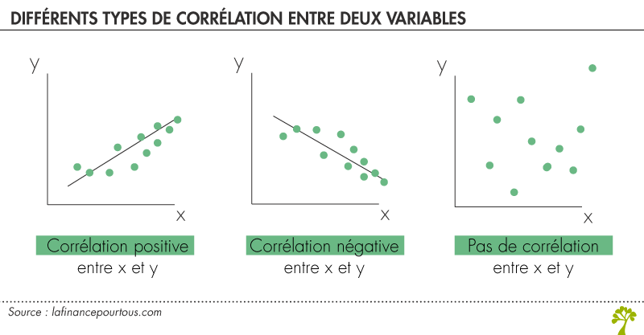

# Rappel des notions
*Que vous avez vues en CM*

# 1. Tendance centrale & dispersion

## La Moyenne vs la Médiane {.scrollable}
Comment résumer une distribution en un seul chiffre ?

::: {.columns}
::: {.column width="50%"}
### La Moyenne
* **Calcul :** Somme des valeurs / Nombre de valeurs.  
* **Qualité :** Rapide, connu; compréhensible.  
* **Défaut :** Sensible aux extrêmes.  
    * *Exemple :* Si un milliardaire entre dans un PMU, le "salaire moyen" explose.  
:::

::: {.column width="50%"}
### La Médiane
* **Calcul :** La valeur du milieu (50% au-dessus, 50% en-dessous).  
* **Qualité :** Robuste.  
* **Défaut :** Plus long à calculer à la main.  
    * *Exemple :* Le salaire médian du bar ne bouge presque pas avec le milliardaire.  
:::
:::

## La dispersion : Variance & Écart-type {.scrollable}
La moyenne cache la réalité. Voici des outils pour s'en prémunir.  

* **La Variance ($V$) :** C'est la moyenne des carrés des écarts à la moyenne.  
    * *Utilité :* C'est une étape mathématique préalable à l'écart-type.  
    * *Problème :* Difficile à interpréter  
    
    
* **L'Écart-type ($\sigma$) :** Racine carrée de la variance.  
    * *Utilité :* On revient à l'unité d'origine.  
    * *Sens :* C'est l'écart "moyen" ou "typique" entre les individus.  
    
**Un exemple concret :** Nous avons deux classes de terminale (10 élèves).  
* **Classe A :** 5 élèves ont eu **8/20** et 5 élèves ont eu **12/20**.  
* **Classe B :** 5 élèves ont eu **5/20** et 5 élèves ont eu **15/20**.  

Est-ce que les moyennes sont les mêmes ?

<details>
  <summary>Voir les moyennes des classes</summary>
  
  Oui, elles sont identiques $\rightarrow$ 10 de moyenne.
  
* **Classe A :** $(5 \times 8 + 5 \times 12) = 100$  
      $100/ 10 = \mathbf{10}$

* **Classe B :** $(5 \times 5 + 5 \times 15) = 100$  
      $100/ 10 = \mathbf{10}$
</details>

**Et la dispersion est-elle la même ?** Calculons la variance et l'écart-type.

<details>
  <summary>Calcul de la Variance</summary>

  **Formule :** On fait la moyenne des écarts au carré.
  
  **Pour la Classe A :**  
  * Écarts : $8-10 = -2$ et $12-10 = +2$  
  * Carrés : $(-2)^2 = 4$ et $(2)^2 = 4$  
  * Variance : $(5 \times 4 + 5 \times 4) = 40$  
    $40/ 10 = \mathbf{4}$  

  **Pour la Classe B :**  
  * Écarts : $5-10 = -5$ et $15-10 = +5$  
  * Carrés : $(-5)^2 = 25$ et $(5)^2 = 25$  
  * Variance : $(5 \times 25 + 5 \times 25) = 250$  
    $250/ 10 = \mathbf{25}$  
</details>

<details>
  <summary>Résultats (Écart-type) et Interprétation</summary>

  Pour revenir à une note sur 20, on prend la racine carrée ($\sqrt{V}$).  

* **Classe A :** $\sigma = \sqrt{4} = \mathbf{2}$  
  
* **Classe B :** $\sigma = \sqrt{25} = \mathbf{5}$  

  **Conclusion :**  
  Bien que la moyenne soit la même (10/20), la **Classe B** est beaucoup plus hétérogène (plus dispersée) que la **Classe A** qui est plus homogène.  
  
  En moyenne, dans la classe B, les élèves sont à 5 points de la moyenne, contre seulement 2 points dans la classe A.  
</details>


## Les Quantiles {.scrollable}  
Pour voir les inégalités, on découpe la population en parts égales.  

* **Quartiles (4 parts) :**  
    * Q1 : Les 25% les plus pauvres.  
    * Q2 (Médiane) : 50% de la population gagne moins, 50% gagne plus.  
    * Q3 : Les 75% (le seuil d'entrée des 25% les plus riches).  
* **Déciles (10 parts) :** D1 (les 10% les plus pauvres) à D9.  

| Quantile | Secteur privé (€) | Fonction publique (€) |
| :--- | :---: | :---: |
| **1ᵉʳ décile (D1)** | 1 510 | 1 670 |
| **1ᵉʳ quartile (Q1)** | 1 740 | 1 950 |
| **Médiane (Q2)** | 2 180 | 2 380 |
| **3ᵉ quartile (Q3)** | 2 990 | 2 990 |
| **9ᵉ décile (D9)** | 4 300 | 3 800 |
  
<details>
  <summary>Comment lire ce tableau ?</summary>

  **Lecture :**  
  
  * **Pour D1 (Privé) :** "10 % des salariés du secteur privé gagnent **moins de** 1 510 euros nets par mois." (On peut aussi dire : "90 % gagnent plus").  
  * **Pour la Médiane (Public) :** "La moitié des agents du public gagne moins de 2 380 euros, l'autre moitié gagne plus."  
  * **Pour D9 (Privé) :** "90 % des salariés gagnent moins de 4 300 euros." (Ou : "Les 10 % les mieux payés gagnent **plus de** 4 300 euros").  

  **Observation sociologique :**
  On remarque que les bas salaires sont mieux rémunérés dans le public (D1 public > D1 privé), mais que les très hauts salaires s'envolent dans le privé (D9 privé > D9 public).  


*(Source : [Insee, Dispersion des salaires nets mensuels en équivalent temps plein en 2023](https://www.insee.fr/fr/statistiques/7457170#tableau-figure3))*  
</details>

# 2. La visualisation graphique (dataviz)

## La boîte à moustache (Boxplot) {.scrollable}

Un résumé visuel de 5 informations clés.

* La **Boîte** contient 50% des salariés (l'écart inter-quartile).
* La **Barre** au milieu est la médiane.
* Les **Moustaches** vont ici jusqu'aux déciles (D1 et D9) pour voir les extrêmes.


```{r}
#| label: fig-salaires
#| fig-cap: "Dispersion des salaires"
#| echo: true
#| code-fold: true
#| output-location: default
#| code-summary: "Voir le code R"
#| fig-height: 5
#| fig-width: 9
#| lightbox: true

library(ggplot2)

# 1. On crée la "DB" (le petit tableau de données) manuellement
df_salaires <- data.frame(
  Secteur = c("Secteur Privé", "Fonction Publique"),
  D1      = c(1510, 1670),  
  Q1      = c(1740, 1950),  
  Mediane = c(2180, 2380),  
  Q3      = c(2990, 2990),  
  D9      = c(4300, 3800)   
)

# 2. On génère le graphique
ggplot(df_salaires, aes(x = Secteur, fill = Secteur)) +
  geom_boxplot(
    aes(ymin = D1, lower = Q1, middle = Mediane, upper = Q3, ymax = D9),
    stat = "identity",  
    width = 0.5         
  ) +
  scale_fill_manual(values = c("#404080", "#C04657")) + 
  labs(
    title = "Dispersion des salaires (Nets mensuels)",
    y = "Euros (€)",
    x = "",
    caption = "Source : Insee 2023"
  ) +
  
  scale_y_continuous(labels = scales::label_number(big.mark = " ")) + # Séparateur de milliers
  
  theme_minimal() +
  theme(legend.position = "none")
```


## L'Histogramme {.scrollable}

**Le principe des "Classes" :**

Pour résumer l'information, on regroupe les pays par paquets (ici des tranches de 5 ans).

* **L'axe horizontal :** L'espérance de vie.  
* **L'axe vertical :** Le nombre de pays dans cette tranche.  
* **La forme :** Avec 183 pays, on voit une inégalité pour l'espérance de vie.  

```{r}
#| label: fig-histo
#| fig-cap: "Distribution mondiale de l'espérance de vie (183 pays, OMS 2015)"
#| echo: true
#| code-fold: true
#| code-summary: "Voir le code R"
#| fig-height: 5
#| lightbox: true

library(ggplot2)

# 1. Données
df_pays <- data.frame(
  Esp_Vie = c(
    83.7, 83.4, 83.1, 82.8, 82.8, 82.7, 82.7, 82.5, 82.4, 82.4, 
    82.3, 82.2, 82.0, 81.9, 81.81, 81.8, 81.7, 81.6, 81.5, 81.4, 
    81.2, 81.1, 81.0, 81.0, 80.8, 80.6, 80.5, 80.5, 79.6, 79.1, 
    79.1, 78.8, 78.5, 78.2, 78.1, 78.0, 77.8, 77.8, 77.7, 77.6, 
    77.5, 77.4, 77.1, 77.0, 76.9, 76.7, 76.7, 76.6, 76.4, 76.3, 
    76.2, 76.2, 76.1, 76.1, 76.1, 76.0, 75.9, 75.8, 75.7, 75.6, 
    75.6, 75.5, 75.5, 75.5, 75.3, 75.2, 75.0, 75.0, 75.0, 74.9, 
    74.9, 74.9, 74.8, 74.8, 74.8, 74.7, 74.6, 74.6, 74.6, 74.5, 
    74.5, 74.4, 74.3, 74.1, 74.1, 74.0, 74.0, 73.9, 73.6, 73.6, 
    73.5, 73.5, 73.3, 73.2, 73.2, 72.7, 72.7, 72.3, 72.1, 72.0, 
    71.9, 71.8, 71.6, 71.3, 71.2, 71.1, 70.9, 70.7, 70.6, 70.5, 
    70.2, 70.1, 69.9, 69.8, 69.7, 69.4, 69.4, 69.2, 69.2, 69.1, 
    68.9, 68.8, 68.7, 68.5, 68.3, 68.3, 67.5, 66.7, 66.6, 66.4, 
    66.3, 66.3, 66.2, 66.1, 66.0, 65.8, 65.7, 65.7, 65.7, 65.5, 
    64.8, 64.7, 64.7, 64.5, 64.1, 63.5, 63.5, 63.5, 63.4, 63.1, 
    62.9, 62.9, 62.4, 62.3, 61.8, 61.8, 61.8, 61.4, 61.1, 60.7, 
    60.5, 60.0, 59.9, 59.9, 59.8, 59.6, 59.0, 58.9, 58.9, 58.3, 
    58.2, 58.2, 57.6, 57.3, 57.3, 55.0, 54.5, 53.7, 53.3, 53.1, 
    52.5, 52.4, 50.1
  )
)

# 2. Histogramme avec bornes strictes
ggplot(df_pays, aes(x = Esp_Vie)) +
  geom_histogram(
    breaks = seq(50, 85, 5), # On impose les coupures : 50, 55, 60...
    closed = "left",        # [50, 55[ (50 inclus, 55 exclu) - Un standard en démographie
    
    fill = "#404080",       
    color = "white",
    alpha = 0.8
  ) +
  labs(
    y = "Nombre de pays",
    x = "Espérance de vie (années)",
    title = "Répartition mondiale (OMS 2015)"
  ) +
  theme_minimal() +
  # Légende de l'ordonnée
  scale_y_continuous(breaks = seq(0, 60, 10)) +
  
  # Légende de l'abscisse X :
  scale_x_continuous(breaks = seq(50, 85, 5))
```


# 3. Statistiques bivariées
*Comprendre le lien entre deux phénomènes*

## Le Nuage de points {.scrollable}
Avant de calculer, il faut **regarder**.
Posons-nous la question : *"Est-ce que la richesse monétaire augmente la longévité ?"*

* **Axe X (Horizontal) :** La richesse (PIB/habitant).
* **Axe Y (Vertical) :** La santé (Espérance de vie).
* **Chaque point** est un pays.

```{r}
#| label: fig-nuage-reel
#| fig-cap: "Lien PIB par hab / espérance de vie (source : Banque Mondiale 2022)"
#| echo: true
#| code-fold: true
#| code-summary: "Voir le code R"
#| fig-height: 5
#| lightbox: true

library(ggplot2)

# Données exactes (Banque Mondiale 2022)
df_demo <- data.frame(
  Pays = c("Sierra Leone", "Inde", "Vietnam", "Brésil", "Chine", "France", "USA", "Suisse"),
  PIB = c(860, 2347, 4147, 9281, 12970, 40988, 76657, 94394),
  Esp_Vie = c(61, 72, 75, 75, 78, 82, 77, 84)
)

ggplot(df_demo, aes(x = PIB, y = Esp_Vie)) +
  geom_point(size = 4, color = "#404080") +
  # Ajustement des étiquettes pour éviter qu'elles ne se chevauchent
  geom_text(aes(label = Pays), vjust = -1.2, size = 3.5) + 
  
  # Axe X : Format monétaire propre
  scale_x_continuous(labels = scales::label_number(big.mark = " "), limits = c(0, 100000)) +
  
  scale_x_continuous(labels = scales::label_number(big.mark = " ")) +
  
  labs(title = "Lien PIB par hab. / espérance de vie", 
       subtitle = "Sélection de 8 pays (2022)",
       x = "PIB/hab (en $)", y = "Espérance de vie (années)") +
  theme_minimal() +
  ylim(50, 90)
```

<details> 
<summary>Qu'est-ce qu'on observe ?</summary>

On voit que les points ne sont pas mis au hasard. Ils forment une "banane" ou une ligne qui "monte".

* **Tendance globale :** Il y a une **corrélation positive** $\rightarrow$ Plus un pays est riche, plus l'espérance de vie est élevée (Sierra Leone vs Suisse).  
* **Nuance (Efficacité) :** L'argent ne fait pas tout.  
    * Le **Vietnam** a une espérance de vie élevée (75 ans) malgré un PIB modeste.  
    * Les **USA** "sous-performent" : ils sont très riches mais stagnent à 77 ans (inégalités, système de santé).  


</details>


## Le coefficient de corrélation ($r$) {.scrollable}

C'est un indicateur standardisé (entre -1 et +1) qui mesure l'intensité du lien linéaire.

### Le sens de la pente (+ ou -)
Le signe dépend de la direction du nuage de points.

::: {.columns}
::: {.column width="50%"}
**Corrélation Positive ($r > 0$)**  
*Les variables varient dans le même sens.*  
* Quand X monte, Y monte.  
* Quand X descend, Y descend.  
* **Forme :** Une pente montante 📈.  
* *Exemple :* PIB/hab et Espérance de vie.  
:::

::: {.column width="50%"}
**Corrélation Négative ($r < 0$)**  
*Les variables varient en sens inverse.*  
* Quand X monte, Y descend.  
* Quand X descend, Y monte.  
* **Forme :** Une pente descendante 📉.  
* *Exemple :* Nombre de cigarettes fumées et Espérance de vie.  
:::
:::

{width=900px}


---

## Comment le calcule-t-on ? {.scrollable}

La formule est : $r = \frac{Cov(X,Y)}{\sigma_X \cdot \sigma_Y}$ ?

C'est une opération en **deux temps** : mesurer, puis nettoyer.

### 1. Le numérateur : La covariance ($Cov$)  

<details>
  <summary>Voir la formule de la Covariance</summary>
  
  $$Cov(X,Y) = \frac{1}{n} \times [ (x_1 - \bar{x})(y_1 - \bar{y}) + \dots + (x_n - \bar{x})(y_n - \bar{y}) ]$$
Dans notre cas $(x_1 - \bar{x})$ est le PIB/hab du premier pays - le Pib/hab moyen ;  
Et $(y_1 - \bar{y})$ est l'espérance de vie du premier pays - l'espérance de vie moyenne

</details>  

C'est la **mesure brute** du lien.  
  
Elle fait la moyenne des produits des écarts.  
  
* *Problème :* Elle dépend des unités.  
  
* *Exemple :* Ici, on multiplie des **Dollars** par des **Années**. Le résultat est en "Dollars-Années". Ce chiffre est gigantesque et impossible à interpréter.  

### 2. Le dénominateur : Les Écarts-types des variables ($\sigma_X \cdot \sigma_Y$)  
C'est la **mesure de la dispersion** de chaque variable.  
* $\sigma_X$ est en **Dollars**.  
* $\sigma_Y$ est en **Années**.  


### 3. Le résultat : Pourquoi on divise ?  
On divise le Numérateur par le Dénominateur pour **annuler les unités**.

Voici en langage courant la formule du coefficient de corrélation :

$$\text{Corrélation} = \frac{\text{Variation commune (Dollars} \times \text{Années)}}{\text{Variation totale (Dollars} \times \text{Années)}}$$  

::: {.callout-important icon="false"}
**Ce qu'il faut retenir :**  
En divisant la Covariance par les Écarts-types, on "nettoie" l'indicateur.
On passe d'un chiffre flou (ex: 450 000) à un **ratio pur** compris entre -1 et 1.  

Calculons le coefficient de corrélation pour PIB/hab & l'espérance de vie via R   
:::

```{r}
#| label: calc-cor
#| echo: true
#| code-fold: true
#| code-summary: "Vérifier le calcul en R"

# Nos données
pib <- c(860, 2347, 4147, 9281, 12970, 40988, 76657, 94394)
esp <- c(61, 72, 75, 75, 78, 82, 77, 84)

# Calcul direct
resultat <- cor(pib, esp)
# Affiche le résultat
print(paste("Le coefficient de corrélation est de :", round(resultat, 2)))
```
* **Interprétation :**  
Le résultat ($r = 0.66$) confirme une forte corrélation positive.
Cela signifie qu'un PIB/habitant élevé est généralement associé à une espérance de vie plus longue (les deux varient dans le même sens).


## La régression linéaire : la "prédiction" {.scrollable}
On ne veut plus juste constater le lien, on veut le **modéliser** pour faire des prévisions.
On trace une droite qui passe "au milieu" du nuage.

C'est l'équation : $Y = a \cdot X + b$

Mais en langage courant :
$$Espérance = (Pente \times Richesse) + Socle$$

* **La pente ($a$) :** C'est le "taux de conversion" (combien d'argent pour gagner 1 an ?).
* **L'ordonnée à l'origine, le "socle" ($b$) :** Le point de départ (espérance de vie sans richesse).

```{r}
#| label: fig-reg-calc
#| fig-cap: "Modèle linéaire calculé"
#| echo: true
#| code-fold: true
#| code-summary: "Voir le code R et le calcul"
#| fig-height: 4.5
#| lightbox: true

library(ggplot2)

# 1. Données
df_demo <- data.frame(
  Pays = c("Sierra Leone", "Inde", "Vietnam", "Brésil", "Chine", "France", "USA", "Suisse"),
  PIB = c(860, 2347, 4147, 9281, 12970, 40988, 76657, 94394),
  Esp_Vie = c(61, 72, 75, 75, 78, 82, 77, 84)
)

# 2. Le Calcul (La machine à prédiction)
modele <- lm(Esp_Vie ~ PIB, data = df_demo)
coeffs <- coef(modele)
b_socle <- round(coeffs[1], 1)       # L'ordonnée à l'origine
a_pente <- format(coeffs[2], scientific=FALSE, digits=5) # La pente

# 3. Le Graphique
ggplot(df_demo, aes(x = PIB, y = Esp_Vie)) +
  geom_point(size = 4, color = "#404080") +
  geom_smooth(method = "lm", se = FALSE, color = "#C04657", size = 1.5) +
  geom_text(aes(label = Pays), vjust = -1.2, size = 2.5) +
  scale_x_continuous(labels = scales::label_number(big.mark = " ")) +
  labs(
    title = paste0("Modèle : Espérance = ", a_pente, " * PIB + ", b_socle),
    subtitle = "L'équation est calculée automatiquement par R ci-dessus",
    x = "PIB/hab (en $)", y = "Espérance de vie (en années)"
  ) +
  theme_minimal()
```

<details>
  <summary>Lecture des résultats</summary>
  
  R a calculé la droite idéale et affiche l'équation au-dessus du graphique.  
  
  **L'équation exacte est :**  
  $$Y = 0.000126X + 71,7$$  

  * **1. Le socle ($b = 71,7$) :**  
      Le modèle est très optimiste ! Il suggère que le niveau de base théorique (si PIB = 0) est de **71,7 ans**.  
      *Cela met en évidence la situation critique de la Sierra Leone (le point tout en bas à 61 ans), qui est 10 ans en dessous de ce standard théorique.*  
      *Cependant, ce résultat est a relativiter, seuls 8 pays ont été pris en compte dans le modèle !*

  * **2. L'effet richesse ($a = 0.000126$) :**  
      La pente est douce. Pour gagner **1 an** d'espérance de vie supplémentaire, il faut augmenter le PIB d'environ **7 950 $**.  
      *(Calcul : $1 / 0.00012586 \approx 7945$)*.  
  ---
  **Analyse des résidus (Les points loin de la ligne) :**  
  * **Les USA (à droite)** sont nettement **en dessous** de la ligne rouge. Vu leur richesse massive, le modèle "prédit" qu'ils devraient vivre plus vieux (vers 85 ans), mais ils stagnent à 77.  
  * **Le Vietnam et la Chine** sont **au-dessus** ou sur la ligne : ils transforment très efficacement leur richesse en santé.  
</details>

# 4. Analyse des données qualitatives
*Croiser des catégories (Tableaux croisés)*

## Le Test du Khi-deux ($\chi^2$) {.scrollable}
Le juge de paix des tableaux croisés. Il permet de savoir si le lien observé entre deux variables qualitatives est "réel" ou dû au hasard.

* **Le principe :** On compare le **Tableau Observé** (la réalité) au **Tableau Théorique** (ce qui se passerait s'il n'y avait aucun lien).
* **L'indicateur :** Plus l'écart est grand, plus le $\chi^2$ est élevé.

### La p-value (Le verdict)
C'est la probabilité de se tromper en affirmant qu'il existe un lien.

* **Si p-value < 0,05 (5%) :** Le lien est **significatif**. On rejette l'hypothèse de l'indépendance. Il se passe quelque chose !
* **Si p-value > 0,05 :** Le lien n'est **pas significatif**. Les écarts observés sont probablement dus au hasard de l'échantillonnage.

<details>
  <summary>Un exemple simple</summary>
  Imaginons que l'on teste le lien entre "Réussite au permis" et "Sexe".
  
  * On observe 60% de réussite chez les hommes et 58% chez les femmes.
  * Le Khi-deux calcule si ces 2% d'écart sont assez "solides" pour conclure à une différence ou si c'est juste un coup de chance sur nos 100 candidats testés.
</details>

## Le V de Cramer {.scrollable}
Une fois qu'on sait que le lien est "vrai" (via le Khi-deux), on veut savoir s'il est **fort**.

* **Le problème du Khi-deux :** Son chiffre dépend de la taille de l'échantillon. Sur 10 000 personnes, le Khi-deux est toujours énorme.
* **La solution (V de Cramer) :** Un indicateur standardisé entre **0 et 1**.

| Valeur du V | Intensité du lien |
| :--- | :--- |
| **0** | Indépendance totale |
| **< 0,10** | Lien très faible |
| **0,10 à 0,30** | Lien moyen |
| **> 0,30** | Lien fort |
| **1** | Relation parfaite |

::: {.callout-tip}
### À retenir
1. Le **Khi-deux** (et sa p-value) dit **SI** il y a un lien.
2. Le **V de Cramer** dit **COMBIEN** ce lien est intense.
:::

## Fin du retour sur les notions